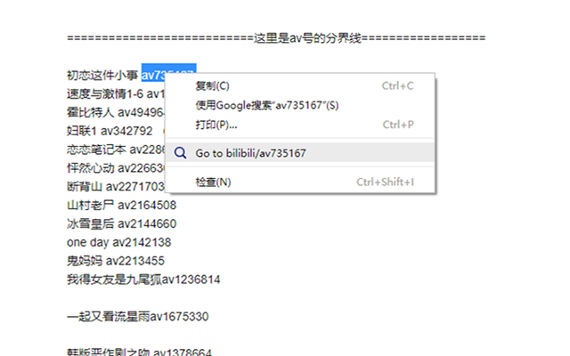
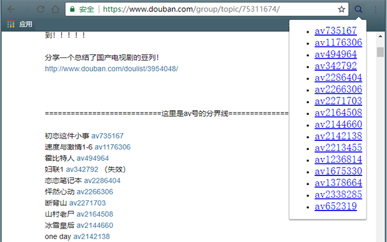
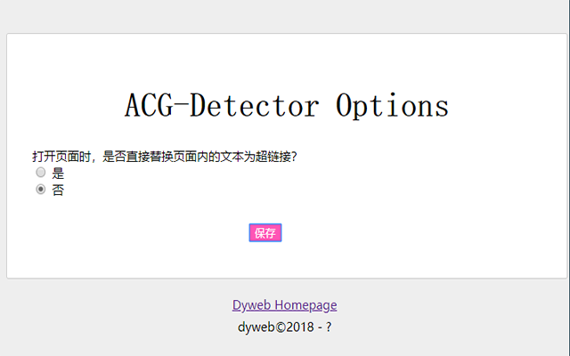

# ACG-Detector

##  Introduction

This browser extension helps get to video page based on the specific video ID.

Since every video from [bilibili](http://bilibili.com), [acfun](http://acfun.cn), [niconico](http://www.nicovideo.jp/) and [pixiv.net](pixiv.net)(illustration instead) has a unique ID. It will be convenient to find video by its ID. Instead of copy ID and search in Google, [acg-detector](https://github.com/dyweb/acg-detector) let you open the video link directly.

### Test page:

This link can be used for testing the extension's work:

https://www.douban.com/group/topic/75311674/

### Features

- Select the video ID and right click to open the video page in your browser.
- Detect video IDs in a webpage and transform them to hyperlinks.
- Click the extension's icon to see all video IDs in a webpage.

### Defects

- Bad taste coding.
- Ugly UI design.
- Lack of ideas...

### Installation

You can install the extension from Chrome Webstore:

https://chrome.google.com/webstore/detail/acg-detector/kabdhpcjocieboohkggemdilfjgonhci

### Screenshots

##  Todo

- [x] Knead some code

- [ ] Learn HTML/JS/CSS

- [ ] Refactor the code

- [ ] Style of the popup(a toolbox for example)

- [ ] Better recognition for video IDs in webpage

- [ ] More ideas...

##  License

MIT
