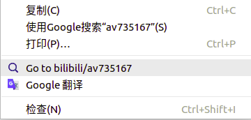
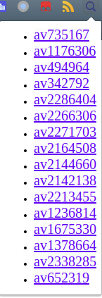
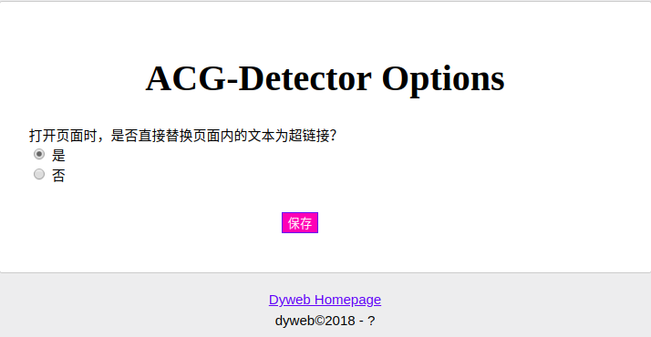

# ACG-Detector

##  Introduction

TODO...

### Test page:
This url can be used for testing extension's work:
https://www.douban.com/group/topic/75311674/

### Features
- Select the video code and right click to the website.
- Detect video codes and transform to hyperlink.
- Click the extension's icon to see all the video codes.

### Defects

- Bad taste coding.
- Ugly UI design.
- Lack of ideas...

### Screenshots

	
    
    

##  TODO

- [x] Knead some code

- [ ] Learn HTML/JS/CSS

- [ ] Refactor the code

- [ ] CSS for popup(toolbox for example)

- [ ] Better recognition for ACG resources link

- [ ] More ideas...

##  License

MIT
